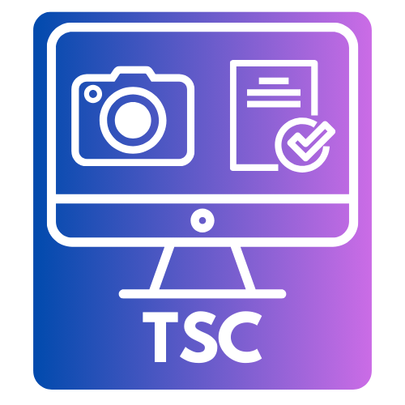

<p align="center">
  
</p>

<h1 align="center">TaskShot</h1>

<p align="center">
  <strong>Take Screenshots the Easy Way!</strong><br>
  Click through any task and TaskShot saves pictures of each step.
</p>

<p align="center">
  Made by Rocco Catrone of Tech Inclusion Pro<br>
  Free to use and share!
</p>

---

## What Does TaskShot Do?

TaskShot helps you make step-by-step guides with pictures. Here's how it works:

1. You click "Start"
2. You do your task (like opening a file or clicking buttons)
3. Every time you click, TaskShot takes a picture
4. When you're done, you get a Word document with all your pictures

It's great for:
- Teaching someone how to do something on a computer
- Making instructions that are easy to follow
- Creating guides that work for everyone, including people who use screen readers

---

## How to Get TaskShot on Your Computer

### What You Need First

You need **Python** on your computer. Python is a free program that makes TaskShot work.

---

## Step-by-Step Download Instructions

### For Mac Computers

**Step 1: Check if you have Python**

1. Open the **Terminal** app (you can find it in Applications → Utilities → Terminal)
2. Type this and press Enter:
   ```
   python3 --version
   ```
3. If you see a number like "Python 3.11.0" you have Python! Skip to Step 3.
4. If you see an error, go to Step 2.

**Step 2: Install Python (only if you don't have it)**

1. Open your web browser
2. Go to: **python.org/downloads**
3. Click the big yellow "Download Python" button
4. Open the file you downloaded
5. Follow the instructions to install it
6. When it's done, close Terminal and open it again

**Step 3: Download TaskShot**

1. Open Terminal
2. Copy this line and paste it into Terminal, then press Enter:
   ```
   git clone https://github.com/Tech-Inclusion-Pro/TaskShot-Compiler.git
   ```
3. Wait for it to finish downloading

**Step 4: Install the extra pieces TaskShot needs**

1. In Terminal, copy and paste this line, then press Enter:
   ```
   cd TaskShot-Compiler && pip3 install -r requirements.txt
   ```
2. Wait for it to finish (this might take a minute)

**Step 5: Give TaskShot permission to work**

TaskShot needs permission to take screenshots and see your mouse clicks.

1. Click the Apple menu (top left of your screen)
2. Click **System Settings**
3. Click **Privacy & Security** on the left side
4. Click **Screen Recording**
5. Click the **+** button
6. Find and add **Terminal**
7. Go back and click **Accessibility**
8. Click the **+** button
9. Find and add **Terminal**
10. Go back and click **Input Monitoring**
11. Click the **+** button
12. Find and add **Terminal**

**Step 6: Run TaskShot**

1. In Terminal, type this and press Enter:
   ```
   cd ~/TaskShot-Compiler && python3 main.py
   ```
2. TaskShot will open!

---

### For Windows Computers

**Step 1: Install Python**

1. Open your web browser
2. Go to: **python.org/downloads**
3. Click the big yellow "Download Python" button
4. Open the file you downloaded
5. **IMPORTANT:** Check the box that says "Add Python to PATH"
6. Click "Install Now"
7. Wait for it to finish

**Step 2: Download TaskShot**

1. Open your web browser
2. Go to: **github.com/Tech-Inclusion-Pro/TaskShot-Compiler**
3. Click the green "Code" button
4. Click "Download ZIP"
5. Find the ZIP file in your Downloads folder
6. Right-click it and choose "Extract All"
7. Click "Extract"

**Step 3: Install the extra pieces TaskShot needs**

1. Press the Windows key on your keyboard
2. Type "cmd" and press Enter (this opens Command Prompt)
3. Type this and press Enter:
   ```
   cd Downloads\TaskShot-Compiler-main
   ```
4. Type this and press Enter:
   ```
   pip install -r requirements.txt
   ```
5. Wait for it to finish

**Step 4: Run TaskShot**

1. In Command Prompt, type this and press Enter:
   ```
   python main.py
   ```
2. TaskShot will open!

---

### For Linux Computers

**Step 1: Install what you need**

Open Terminal and type these lines one at a time, pressing Enter after each:

For Ubuntu or Debian:
```
sudo apt update
sudo apt install python3 python3-pip python3-tk scrot git
```

For Fedora:
```
sudo dnf install python3 python3-pip python3-tkinter scrot git
```

**Step 2: Download TaskShot**

In Terminal, type this and press Enter:
```
git clone https://github.com/Tech-Inclusion-Pro/TaskShot-Compiler.git
```

**Step 3: Install the extra pieces**

Type this and press Enter:
```
cd TaskShot-Compiler && pip3 install -r requirements.txt
```

**Step 4: Run TaskShot**

Type this and press Enter:
```
python3 main.py
```

---

## Important: About the Terminal Window

> **When TaskShot runs, a Terminal window will open. This is NORMAL!**
>
> The Terminal window needs to stay open while you use TaskShot. Don't close it!
>
> When you close TaskShot, the Terminal window will close by itself.
>
> This is how TaskShot gets permission to see your mouse clicks.

---

## How to Use TaskShot

### Starting a New Project

1. Open TaskShot
2. Type a name for your project (like "How to Save a File")
3. Click the purple **Start Capture** button

### Taking Screenshots

1. After you click Start, do your task like normal
2. Every time you click your mouse, TaskShot takes a picture
3. You'll see a red circle where you clicked
4. The number at the top shows how many pictures you've taken

### Finishing Up

1. Click the **Stop Capture** button when you're done
2. You'll see all your pictures
3. For each picture:
   - Add a **title** (like "Step 1: Click the File menu")
   - Add **notes** if you want to explain more
   - Add **alt text** (this describes the picture for people who can't see it)
4. Click **Generate Document**
5. Your Word document will be saved to your Desktop!

---

## Keyboard Shortcuts

You can use your keyboard instead of clicking:

| Press These Keys | What Happens |
|------------------|--------------|
| Ctrl+Shift+S | Start taking screenshots |
| Ctrl+Shift+X | Stop taking screenshots |
| Ctrl+Shift+H | Open help |
| Arrow keys ← → | Look at different screenshots |
| Delete | Remove a screenshot |

On Mac, use **Cmd** instead of **Ctrl**.

---

## If Something Goes Wrong

### "It won't take screenshots"

**On Mac:**
- Make sure you gave Terminal permission (see Step 5 in Mac instructions)
- Try closing TaskShot and opening it again

**On Windows:**
- Try right-clicking Command Prompt and choosing "Run as administrator"

**On Linux:**
- Make sure you installed `scrot`

### "It only takes 2 screenshots then stops"

This happens on Mac when Terminal doesn't have permission.

1. Go to System Settings → Privacy & Security → Input Monitoring
2. Make sure Terminal is in the list and turned on
3. Close TaskShot and open it again

### "It says module not found"

Run this command again:
```
pip3 install -r requirements.txt
```

---

## Settings You Can Change

Click the **Settings** button to change:

- **Sound**: Turn the click sound on or off
- **Circle color**: Change the color of the circle that shows where you clicked
- **Circle size**: Make the circle bigger or smaller

---

## Need Help?

If you have questions or find a problem:
- Go to: **github.com/Tech-Inclusion-Pro/TaskShot-Compiler/issues**
- Click "New Issue"
- Tell us what happened

---

## Thank You!

TaskShot is free for everyone to use. It was made to help people create guides that everyone can use, including people with disabilities.

Made with care by **Rocco Catrone of Tech Inclusion Pro**

---
